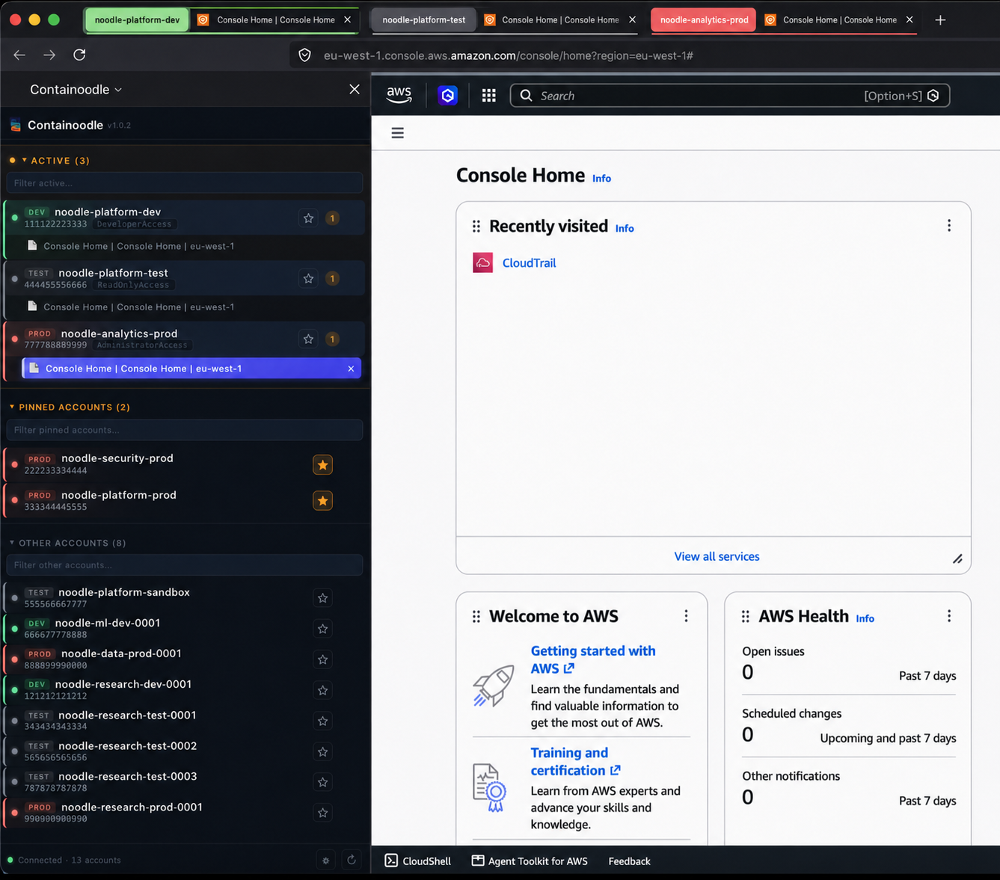
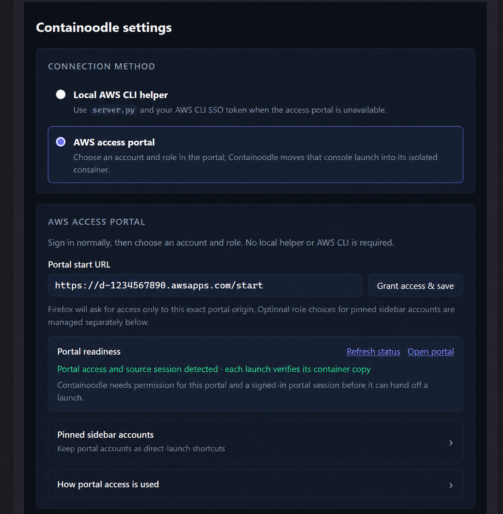
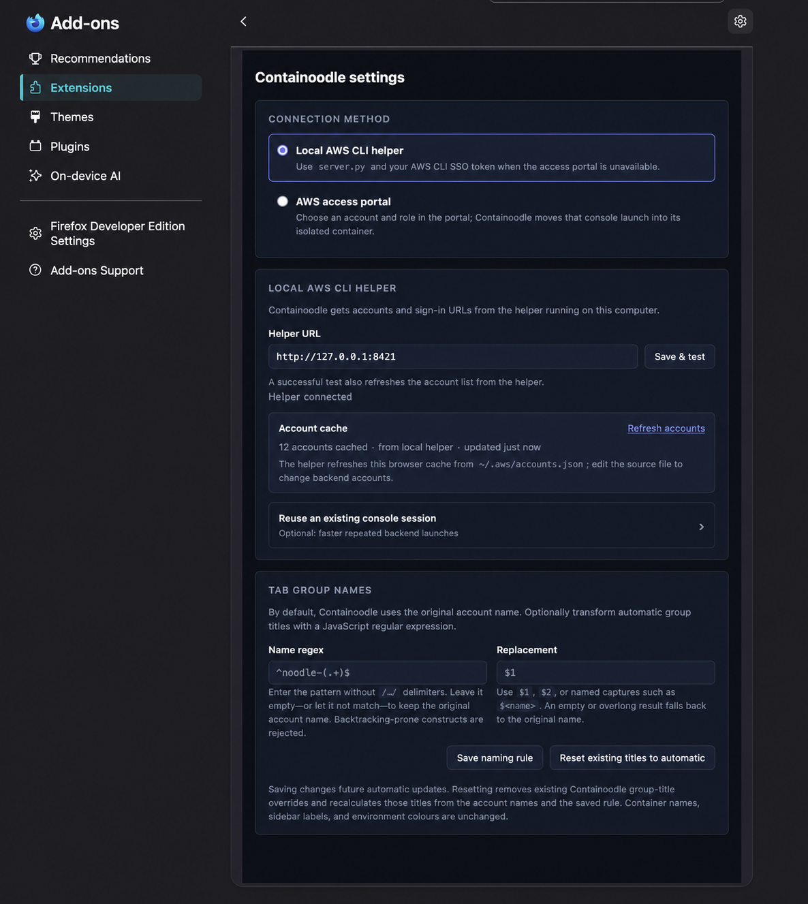
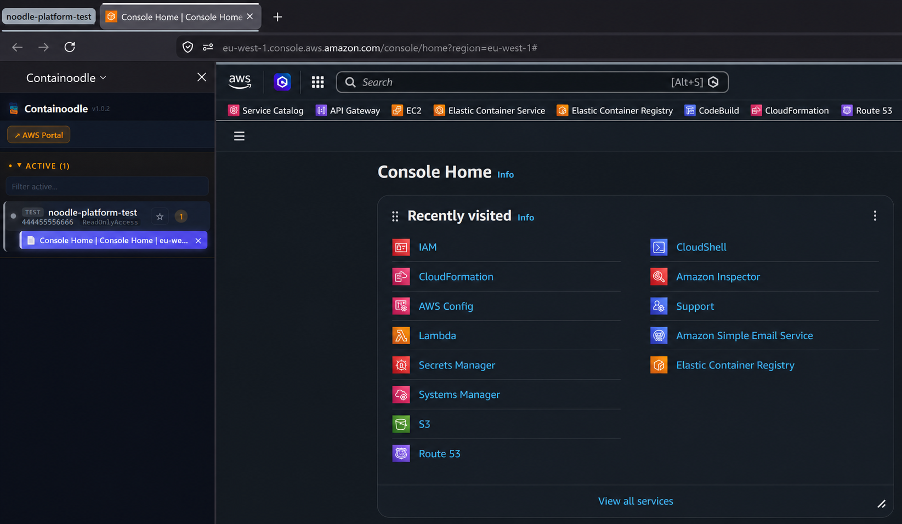
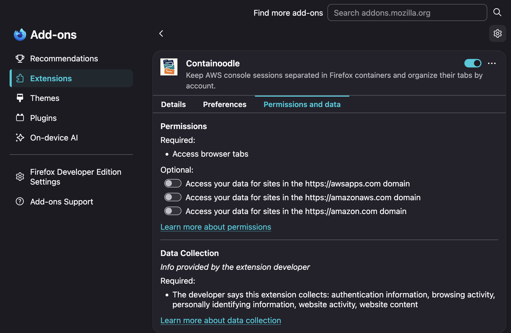

<div align="center">


# Containoodle

**Two ways in. One organised Firefox.**

Containoodle keeps AWS console sessions from colliding by opening each account in
its own named Firefox container and tab group. See at a glance whether you are in
dev, test, or prod, and launch through either your AWS Access Portal or an existing
local AWS CLI SSO session.


[Install](#install-the-extension) · [Set up](#set-up-a-connection) · [Privacy](PRIVACY.md)

</div>

---



<div align="center"><sub>All screenshots use fictional demo account names and IDs.</sub></div>

## Two ways to connect

Choose the path that fits your environment. Both lead to the same result: isolated
AWS sessions, named containers, environment colours, and account-specific tab groups.

| | AWS Access Portal | Local AWS CLI helper |
|---|---|---|
| **Best when** | Your Access Portal is reachable. | Your Access Portal is unavailable or VPN-blocked. |
| **Local component** | None. | `server.py` on `127.0.0.1:8421`. |
| **AWS CLI** | Not required. | AWS CLI v2 with a valid `aws sso login` session. |
| **How you launch** | Choose an account and role in the portal as usual. | Launch with one click from the Containoodle sidebar. |
| **Shortcuts** | Pin active portal accounts; role discovery is optional. | Load accounts from `~/.aws/accounts.json` and pin frequent ones. |

<table>
  <tr>
    <td width="50%" valign="top">
      <strong>AWS Access Portal</strong><br><br>
      <a href="branding/screenshots/access-portal-settings.png">
        
      </a>
    </td>
    <td width="50%" valign="top">
      <strong>Local AWS CLI helper</strong><br><br>
      <a href="branding/screenshots/local-helper-settings.png">
        
      </a>
    </td>
  </tr>
</table>

## The problem

AWS offers [opt-in multi-session support](https://docs.aws.amazon.com/awsconsolehelpdocs/latest/gsg/multisession.html)
for up to five identities in one browser. Containoodle is aimed at workflows that need
more durable organisation across many accounts:

- **Sessions need structure.** Native multi-session does not create persistent, named Firefox containers or account-specific tab groups.
- **The SSO dance.** Portal → find account → pick role → open, or fall back to a local federation path when the portal is unreachable.
- **"Wait, am I in _prod_?"** A wall of identical console tabs is how the wrong-account change happens.

## What Containoodle does

Containoodle puts every AWS account in a dedicated [Firefox container](https://support.mozilla.org/kb/containers)
so AWS console sessions do not overwrite one another. Use your local AWS CLI SSO
session when the Access Portal is unavailable, or let Containoodle hand launches from
the reachable portal into the right container.

| Capability | Behaviour |
|---|---|
| 🎯 **One click in** | Local helper mode launches from the Containoodle sidebar; portal mode lets you choose the account and role in the AWS Access Portal as usual. A sidebar button focuses or opens the configured portal. Either way, the console lands in the account's container. |
| 🔀 **Two exclusive modes** | **Local helper** uses `server.py` and your AWS CLI SSO token. **Portal** uses the reachable AWS Access Portal with no helper or AWS CLI. Only one mode is active; account lists and remembered roles never cross between them. |
| 🎭 **The right role** | Portal handoffs use the exact role you clicked. Portal shortcuts use only their saved portal role or optional portal role discovery. Backend launches use only backend account/role data and leave final fallback resolution to the helper. |
| 🗂️ **Separated by design** | Each account gets one named container. AWS console cookies stay container-scoped; portal mode copies the scoped SSO authentication cookie needed to bootstrap the selected session. |
| 📑 **Tab groups** | Every account's tabs land in their own Firefox tab group, colour-matched to the environment. Portal handoffs keep the displayed account name when it can be captured; an optional regex pattern and replacement can shorten automatic group titles. Manual titles always win. |
| 🚦 **Environment colours** | The account name decides the colour: **`dev` green · `qa` yellow · `prod` red · `test`/`eval` grey**. Anything unrecognised is treated as **prod (red)** — better a false alarm than a silent prod. |
| 👁️ **Never lose the active tab** | The tab you're on is a solid indigo bar and the sidebar scrolls it into view. |
| 🔌 **Live sidebar** | Containers and tabs are grouped per account and update as you open/close tabs. |
| 🔒 **Local helper** | The optional backend binds to `127.0.0.1`, generates URLs from your local SSO cache, and has no hosted Containoodle service or telemetry. Its session-generation calls go to AWS. |

> **Why "Containoodle"?** It contains sessions, it sounds like a noodle, and naming
> meetings are overrated.

## How it works

**Local helper mode** (default — for machines where the access portal is VPN-blocked):

```
┌─────────────────────────────┐          ┌──────────────────────────────┐
│  Firefox extension (sidebar)│  HTTP ─► │  server.py (Python stdlib)   │
│  • per-account containers   │          │  GET /accounts               │
│  • env colour + active tab  │  ◄─ JSON │  GET /generate-url           │
│  • one-click launch         │          │  GET /roles                  │
└─────────────────────────────┘          └───────────────┬──────────────┘
                                                          ▼
                                          ~/.aws/sso/cache/*.json  (your SSO token)
                                                          ▼
                                          AWS federation endpoint → signed console URL
```

The helper stays on `127.0.0.1`; the extension rejects non-loopback helper
addresses. AWS CLI SSO/STS requests and the AWS
federation request still go to AWS; Containoodle has no hosted backend or telemetry
service.

**Portal mode** (no backend, no AWS CLI — anywhere your access portal is reachable):

```
┌─────────────────────────────┐
│  AWS Access Portal          │   1. sign in in a normal Firefox tab
│  • choose account + role    │   2. click the account/role as usual
└──────────────┬──────────────┘   3. Containoodle recognizes the portal console shortcut
               ▼                  4. the launch is handed into that account's container
┌─────────────────────────────┐   5. the sidebar tracks the tab and tab group
│  Containoodle container  │
└─────────────────────────────┘
```

Configure the portal start URL (`https://d-xxxxxxxxxx.awsapps.com/start`) in the
extension's options page and grant access. A normal portal click captures the
displayed account name associated with the role you selected. If that context is
unavailable, Containoodle uses an existing portal pin or a previously captured portal name
for that account, then finally falls back to `AWS <account-id>`. A successful portal
handoff saves the captured portal name for later sidebar labels, environment colours,
container repair, and automatic tab-group naming.



<div align="center"><sub>A portal launch handed into its account-specific container and tab group.</sub></div>

The portal URL is saved in extension-local `browser.storage.local`. Firefox also
persists the exact-origin permission and content-script registration in this Firefox
profile. The URL is never baked into the source or sent to a Containoodle service.

The options page shows only the active connection method. The **Portal readiness**
card uses the same cookie-scope checks as the launch path to report whether the exact
portal permission and a usable signed-in session are present.

| Permission, host access, or configuration | Required? | Used for |
|---|---:|---|
| `storage` | Core | Configuration, account metadata, account/container ownership, and remembered choices. |
| `contextualIdentities`, `tabs`, `tabGroups` | Core | Creating account containers and managing their tabs and groups. |
| `cookies`, `scripting` | Core APIs; host-scoped | Copying permitted session cookies and installing the exact-portal click handler. They do not grant access to a host by themselves. |
| Exact configured AWS Access Portal origin | Portal mode | Click handoff, session detection, and copying the scoped portal authentication cookie into the selected container. |
| `https://*.amazonaws.com/*` | Optional in Portal mode | Loading role choices when launching or changing a pinned portal shortcut. |
| `https://*.amazon.com/*` | Optional in Backend mode | Reusing a still-valid console session and suppressing the AWS cookie banner in new backend containers. |
| Portal-pinned shortcuts | Optional | Direct portal-mode launches after an active account is pinned from the sidebar. Normal portal-click handoff does not require a pin. |

Portal role choices and backend session reuse have separate **Allow** and
**Revoke** controls inside their respective mode panels. Saving a different portal
URL requests its exact origin and, after a successful change, removes Containoodle's
previous exact-origin grant. Revoking a host permission stops future Containoodle access
to that host but does not delete cookies Firefox already owns.

Backend mode keeps `~/.aws/accounts.json` as the source of truth and offers an
account-cache refresh in its active panel. Portal mode never reads that cache; its
optional shortcuts are created and removed with the ☆/★ control on active sidebar
rows. Backend mode never reads portal pins or portal role history.

The **Tab group names** settings can optionally apply a JavaScript regex pattern and
replacement to automatic group titles. A disabled or non-matching rule, or an empty
result, keeps the original account name. A manually renamed group always takes
precedence. Backtracking-prone constructs are rejected so a naming preference cannot
freeze the extension. **Reset existing titles to automatic** removes stored Containoodle
title overrides and recalculates current groups from the original account names and
the saved rule.

In **both** modes, launched tabs are grouped per account (Firefox tab groups,
env-coloured). A portal handoff always honors the role and destination you just
clicked rather than silently reusing a possibly different live role.

## Install the extension

Containoodle requires **Firefox 142 or newer** because it uses Firefox tab groups and
Firefox's built-in data-consent disclosure. Download the appropriate asset from the
[latest release](../../releases/latest):

- Prefer `containoodle-<version>-signed.xpi` when it is present; it installs permanently on regular Firefox.
- The unsigned `containoodle-<version>.xpi` can be loaded temporarily through `about:debugging` → **This Firefox** → **Load Temporary Add-on**. It is removed when Firefox restarts.
- For permanent unsigned installation, use Firefox Developer Edition or Nightly, set `xpinstall.signatures.required` to `false`, and install the XPI.

Open the sidebar with **View → Sidebar → Containoodle**, `Alt+Shift+A`, or
`Ctrl+Shift+A` on macOS. The installed version appears in the header; the ⚙ button
opens the options page.

## Set up a connection

Switching modes does not merge account lists or remembered roles. Portal launches
never use backend cache/session-reuse logic, and backend launches never use portal
pins or portal role history. Backend favorites store only account IDs; their names,
roles, and launch data still come exclusively from the helper.

### Portal quick start

1. Open Containoodle options and select **AWS access portal**.
2. Enter the exact start URL, for example `https://d-xxxxxxxxxx.awsapps.com/start`, then choose **Grant access & save**.
3. Use **AWS Portal** at the top of the sidebar to open the configured portal or
   focus its existing normal Firefox tab.
4. Sign in to that portal in the normal, non-container Firefox tab.
5. Confirm that **Portal readiness** reports portal access and a signed-in session.
6. Choose an account and role in the AWS portal normally. Containoodle hands that launch into the matching container and tab group.
7. Optional: in the sidebar, choose ☆ on the active account row to keep it as a direct-launch shortcut. Choose ★ later to unpin it; active tabs and the account container remain untouched.

Normal portal clicks and pinning need no broad AWS API permission. Allow **Role
choices for pinned accounts** only if you want Containoodle to load or change a pin's
available roles. Backend session reuse does not apply in portal mode.

### Local helper quick start

Local helper mode requires Python 3.10 or newer and AWS CLI v2. The helper uses only the
Python standard library; no third-party Python packages are required.

1. Clone the public repository:

   ```bash
   git clone <repository-url> containoodle
   cd containoodle
   ```

2. Before starting the helper, create `~/.aws/accounts.json`:

   ```json
   [
     {
       "accountId": "123456789012",
       "accountName": "prod-data",
       "role": "AdministratorAccess",
       "region": "eu-west-1"
     }
   ]
   ```

   `role` and `region` are optional. The helper defaults are
   `AdministratorAccess` and `eu-west-1`.

3. Create or refresh the intended IAM Identity Center session:

   ```bash
   aws sso login --profile PROFILE_NAME
   ```

   The helper is not bound to the profile name. It selects the most recently modified
   file in `~/.aws/sso/cache` that contains an `accessToken`. If several identities are
   cached, log in to the intended profile last.

4. Start the helper:

   ```bash
   python3 server.py
   # Containoodle is now available at http://127.0.0.1:8421
   ```

5. In Containoodle options select **Local AWS CLI helper**, keep or change the helper URL,
   then choose **Save & test**.

Use ☆ beside any backend account to keep it in **Pinned accounts**. The star is
only a sidebar preference: the helper remains the source of its name, role, region,
and launch data. Unpinned inactive accounts remain under **Other accounts**.

For backend sidebar launches, Containoodle checks an explicit backend choice, the account's
configured role, a backend-only remembered choice, and live backend discovery. If the
extension sends no role, the helper uses the account's configured role or
`CONTAINOODLE_DEFAULT_ROLE` (`AdministratorAccess` by default). A configured or selected
role must match a permission set you actually have; otherwise AWS CLI
`get-role-credentials` rejects the launch.

Optional **Reuse an existing console session** access makes repeated backend launches
faster by opening a still-signed-in account container directly and suppressing the
AWS cookie banner in new backend containers. Normal helper launches work without it,
and an explicit role choice always bypasses reuse so the selected role wins.

## Troubleshooting

- **The helper exits immediately:** create a valid `~/.aws/accounts.json` before running `server.py`.
- **The helper reports an expired or wrong SSO session:** run `aws sso login` again; with several cached identities, log in to the intended profile last.
- **The helper reports that the token expires within five minutes:** run `aws sso login` again. Containoodle never moves or deletes the AWS CLI cache to refresh it.
- **AWS CLI rejects a backend role:** select a permission set available to that account, or correct the role in `~/.aws/accounts.json` / `CONTAINOODLE_DEFAULT_ROLE`.
- **A pinned portal shortcut has the wrong role:** allow portal role choices, then click the role chip on that pin and select the intended role.
- **Portal readiness says sign-in is required:** sign in at the exact saved portal URL in a normal Firefox tab, then refresh readiness.
- **The portal opens an ordinary tab or the container asks for login:** verify portal mode, the exact-origin grant, and the signed-in session; then reload the portal page and retry.
- **A tab-group regex does not affect an older group:** use **Reset existing titles to automatic**. This intentionally removes stored manual Containoodle group-title overrides before recalculating them.
- **An unsigned XPI disappears after restart:** temporary add-ons are expected to do that. Use a signed asset when present, or Developer Edition/Nightly for permanent unsigned installation.

## Security notes

Firefox's data disclosure describes the categories the extension handles locally;
it does not mean the developer receives that data. Containoodle has no telemetry or
hosted service. See the [privacy policy](PRIVACY.md) for the complete details.

<details>
  <summary><strong>Firefox permissions and data disclosure</strong></summary>
  <br>
  <a href="branding/screenshots/permissions-and-data.png">
    
  </a>
</details>

- The backend binds to `127.0.0.1` and has no authentication. For account and session endpoints, requests carrying an `Origin` header are accepted from Containoodle extension origins; requests without `Origin` are deliberately available to command-line clients. Any local process that can reach the port can call it, so run it only on a trusted workstation and never expose or forward the port.
- The helper builds session sign-in URLs in memory. It does not write them to Containoodle files or include query strings in its access log; Firefox may retain navigated URLs according to its own history and session policies.
- No real account IDs, credentials, or internal account names are baked into the project. Runtime account metadata comes from `~/.aws`, the clicked AWS Access Portal page, or extension-local storage. Synthetic account IDs remain in examples and tests.
- Container ownership is stored by AWS account ID and Firefox cookie-store ID. A pre-existing Firefox container with the same display name is not reused, so labels cannot merge two account sessions.
- Host permissions are **opt-in at runtime and independently revocable**: core portal setup asks only for the exact configured portal origin. Portal API access is optional and used only for role choices on portal pins. AWS console-cookie access is optional and used only for backend session reuse/banner suppression. Containoodle has no hosted backend and sends no analytics or telemetry to a Containoodle service.
- Containoodle's complete data handling, retention, and deletion terms are in the [privacy policy](PRIVACY.md). Firefox's install prompt discloses the data categories the extension handles even though none of that data is sent to the developer.
- In portal mode, a document-start handler on the exact configured portal reads the validated shortcut URL and the displayed account name associated with the role you click. It does not read forms, credentials, or the rest of the account list. A bounded tab-URL fallback may remove a proven portal-created child tab or return the source tab to the portal only after a successful handoff; redirected or unrelated tabs are left alone.
- **Portal mode trade-off, deliberately accepted:** the `x-amz-sso_authn` cookie can mint console sessions for every account your SSO user is entitled to. Containoodle copies its Firefox domain/path/isolation scope into each launched account's container and verifies the copy before navigation; Firefox may retain it until its original expiry. Optional sidebar role discovery also sends its value as a bearer token directly to the regional AWS portal API. Containoodle never writes the value to extension storage or logs.
- Every release includes an unsigned XPI. When AMO signing secrets are configured, the release workflow also publishes a `-signed.xpi`; use that asset on regular Firefox when present.

## Development

```bash
node --version  # Node.js 20 or newer
npm ci --ignore-scripts
python3 -m py_compile server.py
for js_file in $(git ls-files '*.js'); do node --check "$js_file"; done
npm run check
```

- **CI** (`.github/workflows/ci.yml`) runs these checks, validates the manifest, runs `web-ext lint`, and smoke-builds an XPI on every push or pull request to `main`.
- **Releases** (`.github/workflows/release.yml`) build a versioned unsigned XPI—and a signed XPI when signing secrets are configured—when a pushed `v*` tag matches `manifest.json`.

Before tagging, update the version in `firefox-extension/manifest.json` and
`package.json`, then commit those changes. Replace `X.Y.Z` below with the same
version everywhere:

  ```bash
  git tag vX.Y.Z
  git push origin main vX.Y.Z
  ```

## License

[MIT](LICENSE) © Containoodle contributors
